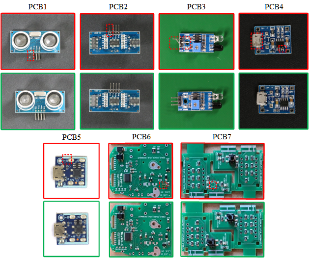

# PCB-Bank Dataset
A collection industrial anomaly detection dataset for Printcd Cicuils Board (PCB).

## Table of Contents
* [Data description](#data-description)
* [Data download](#data-download)
* [Data preparation](#data-preparation)
* [Citation](#citation)
* [License](#license)
## Data description


The PCB-Bank dataset is composed of Printed Circuit Board (PCB) data collected from publicly available industrial anomaly detection datasets. There are 6,749 images with 5,352 normal and 1,397 anomalous samples. It contains 7 subsets corresponding to 7 different PCB as shown in the above figure. 4 subsets are different types of printed circuit boards (PCB) from [VisA](https://github.com/amazon-science/spot-diff). 1 subset is top-view of PCB from [RealIAD](https://realiad4ad.github.io/Real-IAD/). We use [AnyLabeling](https://github.com/vietanhdev/anylabeling) tool to crop each PCB from the original image in [VISION PCB2 subset](https://huggingface.co/datasets/VISION-Workshop/VISION-Datasets) and construct 2 subsets. More details are shown in the following table.

| Object | Original Dataset | # normal samples | # anomaly samples  | # anomaly classes |
|---|-----|-----|-----|-------------------------|
| PCB1 | VisA | 1,004 | 100 | Bent,Melt,Scratch,Missing | 
| PCB2 | VisA | 1,001 | 100 | Bent,Melt,Scratch,Missing | 
| PCB3 | VisA | 1,006 | 100 | Bent,Melt,Scratch,Missing | 
| PCB4 | VisA | 1,005 | 100 | Burnt,Scratch,Missing,Damage,Extra,Wrong Place,Dirt | 
| PCB5 | RealIAD | 445 | 493 | Scratch,Missing parts,Presence of foreign objects,Contamination | 
| PCB6 | VISION | 505 | 425 | Missing IC,Missing HD06-7,Missing US9,Missing T5,Missing IC2,Missing D2 | 
| PCB7 | VISION | 386 | 79 | Missing Switch | 


## Data download
You can download it by this [BaiduYun](https://pan.baidu.com/s/139sfJ5N1hjNNEOBv7JaREA)[Code:mx57]. Note that you should send an email to [realiad4ad@outlook.com](realiad4ad@outlook.com) to get the PCB5 and PCB6 (from RealIAD) subsets. The id2class map functions for multi-class masks can be found in ./id2class.py. Here the masks for normal images are not stored to save space.
The data tree of the downloaded data is as follows.
```shell
PCB-Bank
|-- pcb1
|-----|--- Data
|-----|-----|----- Images
|-----|-----|--------|------ Anomaly 
|-----|-----|--------|------ Normal 
|-----|-----|----- Masks
|-----|-----|--------|------ Anomaly 
|-----|--- image_anno.csv
|-- pcb2
|-----|----- ...
```
## Data preparation
1-class setup: It means model trained with normal samples and test on both normal and anomaly samples. We follows the VisA split setting on PCB1,PCB2,PCB3,PCB4. 200 normal samples from PCB5,PCB6,PCB7 are used for training, while others are used for testing. We give a sample command line for 1-class setup preparation as follows.
~~~~
python prepare_data.py --split-type 1cls --data-folder <PCB-Bank_path> --save-folder <1cls_output_path> --split-file <1cls.csv_path>
~~~~

The data tree of the reorganized 1-class setup is as follows.
```shell
PCB-Bank-1cls
|-- 1cls
|-----|--- pcb1
|-----|-----|----- ground_truth
|-----|-----|----- test
|-----|-----|-------|------- good 
|-----|-----|-------|------- bad 
|-----|-----|----- train
|-----|-----|-------|------- good
|-----|--- pcb2
|-----|--- ...
```
Specifically, the reorganized data for 1-class setup follows the data tree of [MVTec-AD](https://www.mvtec.com/company/research/datasets/mvtec-ad/). For each object, the data has three folders:
- 'train', which includes the normal training images
- 'test', which includes the normal and anomalous test images
- 'ground_truth', which includes the pixel-level annotations of anomalous images

## Citation
Please cite the following paper if this dataset helps your project:

```bibtex
@article{hang2024glad,
  title={GLAD: Towards Better Reconstruction with Global and Local Adaptive Diffusion Models for Unsupervised Anomaly Detection},
  author={Yao, Hang and Liu, Ming and Wang, Haolin and Yin, Zhicun and Yan, Zifei and Hong, Xiaopeng and Zuo, Wangmeng},
  journal={arXiv preprint},
  year={2024}
}
```

## License
The data is released under the CC BY 4.0 license.
